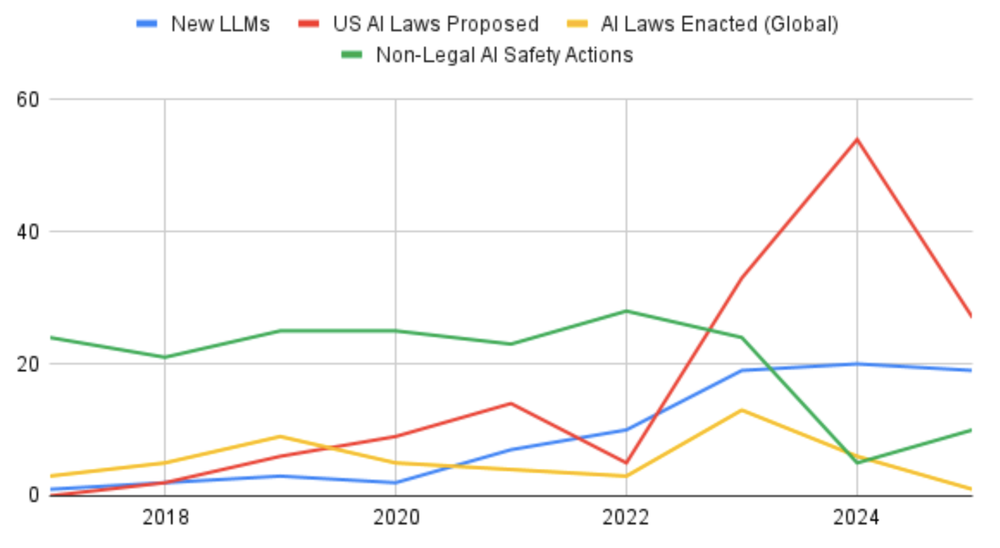
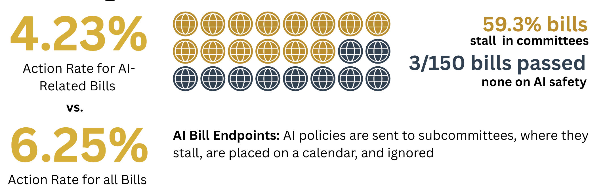
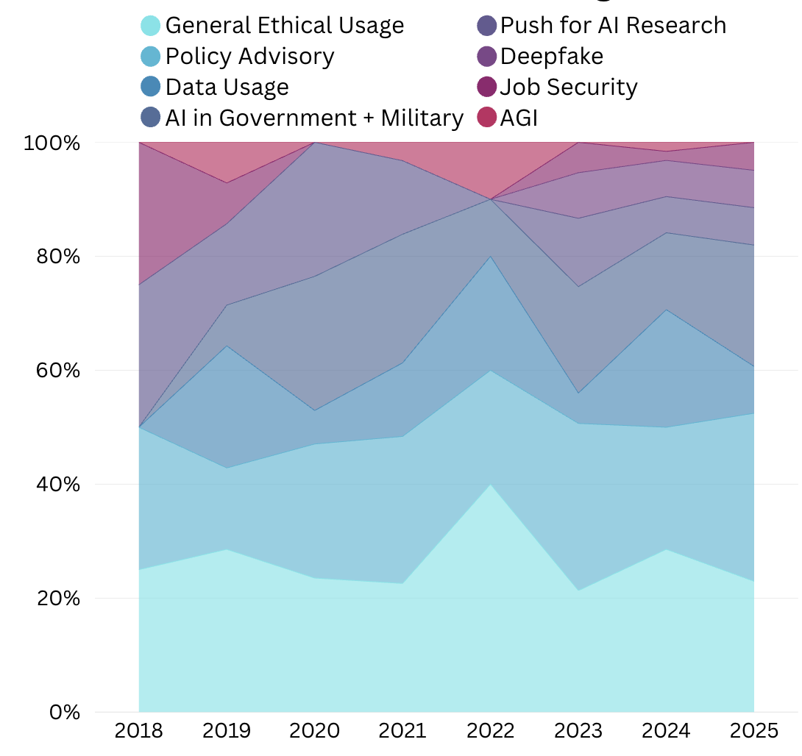
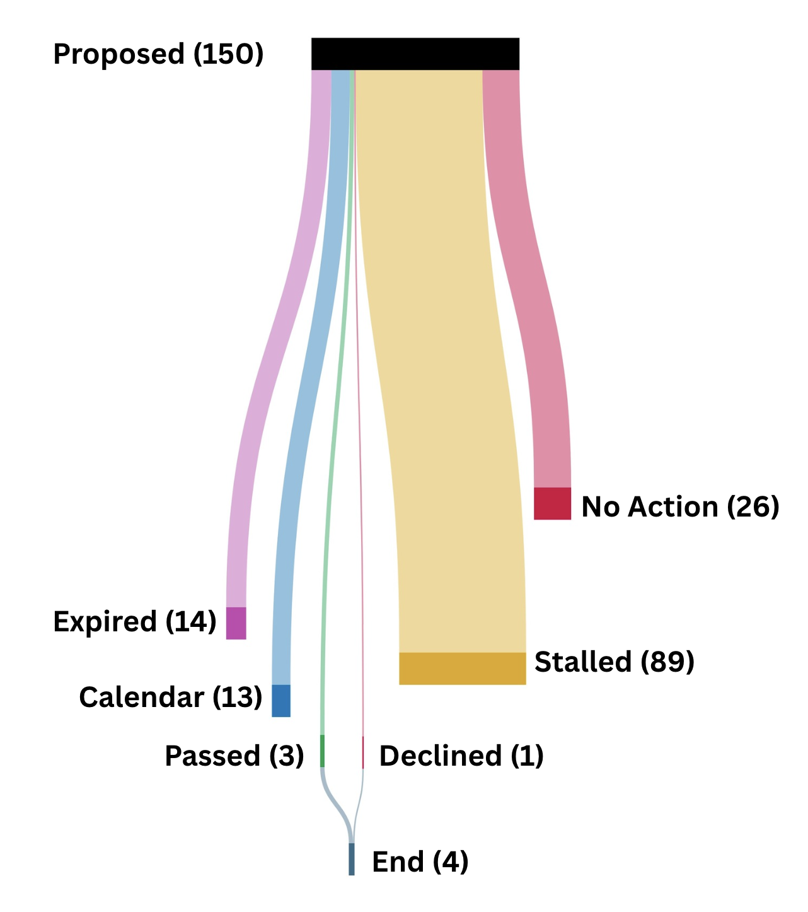
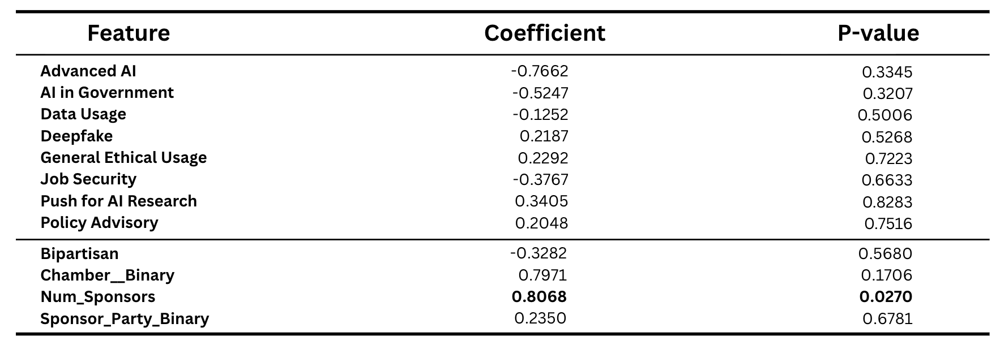

# 🇺🇸🤖 AI Safety Legislation in the U.S. Congress

This repository contains the research paper, dataset, and supplementary materials for our study on **AI Safety Legislation in the United States Congress**, accepted at the **NeurIPS 2025 RegML Workshop**.

## 📄 Paper

**Title:** *From Proposals to Enactment: The Procedural Bottleneck in AI Safety Regulation*  
**Authors:** Mansur Ali Khan, Efe Akengin, Dr. Ahmed Rushdi  
**Workshop:** NeurIPS 2025 Workshop on Regulatable Machine Learning (RegML)  
**View Paper:** https://openreview.net/pdf?id=OCn2y7QDTB

## 📘 Introduction

While AI models advance at unprecedented rates, **AI safety legislation in the United States remains largely symbolic, stalled, or unrealized**.

Through a year-by-year analysis of AI breakthroughs, U.S. congressional proposals, and international legislative enactments, this study identifies a structural gap:

> **The U.S. is not deficient in AI bill proposals — it is deficient in legislative action.**  
> Only **4.23%** of U.S. AI-related bills reached a terminal outcome.

This work quantifies enactment rates, categorizes AI bills across thematic domains, identifies procedural bottlenecks, and develops a penalized logistic regression model to evaluate predictors of congressional stalling.

## ⚙️ Methodology

### **Dataset Construction**

We developed the **first comprehensive dataset of U.S. AI bills (2017–2025, N=150)** by aggregating information from Congress.gov and classifying each bill’s legislative fate.  
Bills were assigned to one of the following end-point categories:

- No Action After Introduction  
- Stalled in Committee (House/Senate)  
- Declined  
- Passed  
- Calendar Inaction (House/Senate)  
- Expired Without Action  

### **Action Rate Metric**

To quantify congressional engagement, we introduce the *Action Rate*: 

Action Rate = (Passed Bills + Declined Bills) / Total Proposed Bills


### **Thematic Classification + Statistical Modeling**

We created a **thematic taxonomy** of AI legislative subfields and applied **penalized logistic regression** to identify predictors of legislative stalling.

Each bill was expanded with **12 explanatory variables** using the Congress.gov API, including:

- chamber origin  
- sponsor party affiliation  
- bipartisanship status  
- number of sponsors  
- thematic domain  
- and others  

A ridge-penalized logistic regression model (C=1.0) was trained with an 80/20 split and **100 bootstrap iterations**. Standard errors and p-values were computed via bootstrap methodology, with significance determined using Bonferroni correction at α = 0.05.

## 📈 Key Findings

<p align="center">
  
  <br><br>
  
  <br><br>
  
  <br><br>
  
  <br><br>
  
</p>

## 📌 Recommendations

**1. Establish dedicated AI-policy committees**  
Leadership inaction often terminates a bill as effectively as a formal vote.

**2. Create independent AI Safety regulatory agencies**  
These agencies should be empowered to regulate AI systems, audit compliance, and intervene proactively.

**3. Introduce Sunset Clauses**  
Time-bound provisions reduce political stagnation and force legislative progress.

**4. Implement preemptive enactment frameworks**  
Policies should automatically activate when defined AI-risk thresholds are reached.

## 🔗 Citation

If you use this work, please cite:

```bibtex
@inproceedings{khan2025aisafety,
  title={From Proposals to Enactment: The Procedural Bottleneck in AI Safety Regulation},
  author={Mansur Ali Khan, Mehmet Efe Akengin, Ahmed Rushdi},
  booktitle={NeurIPS 2025 Workshop on Regulatable Machine Learning (RegML)},
  year={2025}
}
